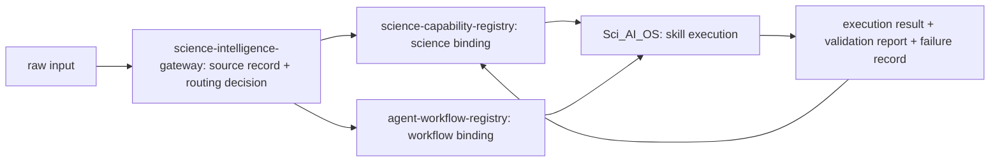

# 四仓科学能力链路最小闭环

## 目标

`science-capability-registry`、`science-intelligence-gateway`、`agent-workflow-registry` 和 `Sci_AI_OS` 合起来构成科学能力从来源识别到执行反馈的主链路。本文件只记录跨仓职责和最小工件边界，不复制其他仓库的真源定义。

## 仓库职责

| 仓库 | 角色 | 输入 | 输出 | 禁止越界 |
| --- | --- | --- | --- | --- |
| `science-intelligence-gateway` | 唯一 raw input 入口和 routing authority | URL、PDF、文本、repo、混合 metadata | source normalization、routing decision、skill spec、execution mapping、files_to_create_or_update | 不执行 solver，不直接写 capability registry，不保存科学 benchmark |
| `science-capability-registry` | 科学能力和验证资产正源 | gateway 选中的 science capability 候选、官方 example、benchmark、论文 | capability card、schema/config、runner、validation、evidence、failure ledger | 不承担 raw input routing，不定义认知 workflow，不执行最终系统 runtime |
| `agent-workflow-registry` | 认知/信息处理 workflow 正源 | gateway 选中的 workflow request | workflow definition、adapter contract、prompt/template、failure mode、validation checklist | 不定义 solver capability，不保存 science benchmark，不绕过 gateway placement |
| `Sci_AI_OS` | Skill 执行系统 | gateway 生成的 skill spec | execution result、trace、validation report、artifact reference、failure record、feedback evidence | 不作为 source ingestion 入口，不重新定义 science/workflow 本体 |

## 最小闭环

## 当前可落地接口

1. gateway 只产出候选和文件计划，不直接改 registry。
2. capability registry 接收 science capability 候选后，先做 capability card、examples index、intern task 和 validation boundary。
3. workflow registry 只描述信息处理和 agent 协作流程，不保存 solver benchmark。
4. Sci_AI_OS 只消费 skill spec 和 registry/workflow binding，执行结果以 artifact reference 和 failure record 回流。

## 对 Gmsh 下一轮的含义

Gmsh 是 OpenFOAM 之后最适合推进的资产方向，因为它位于 solver 之前，是几何、物理边界、网格质量、导出格式和下游 solver consumability 的共同底座。

本轮 registry 先承担：

- 定义 Gmsh C01-C06 capability map。
- 为 C02-C06 建立 benchmark_candidate 资产卡和 intern task。
- 不把尚未实现 runner 的 C02-C06 注册进 runtime catalog。
- 将后续 execution binding 留给 gateway + Sci_AI_OS，不在 capability registry 里模拟系统执行。

## 验收边界

当前阶段完成后，应该能够回答：

- 一个新来源为什么进入 Gmsh 而不是 OpenFOAM、FEniCSx 或 workflow registry。
- Gmsh 的首批能力如何覆盖 geometry、physical group、mesh quality、CAD import、boundary-layer/size field 和 multi-solver export。
- 哪些能力已经可调度，哪些只是候选资产。
- 后续 agent 或实习生应从哪个 asset/task/schema/report 继续。
